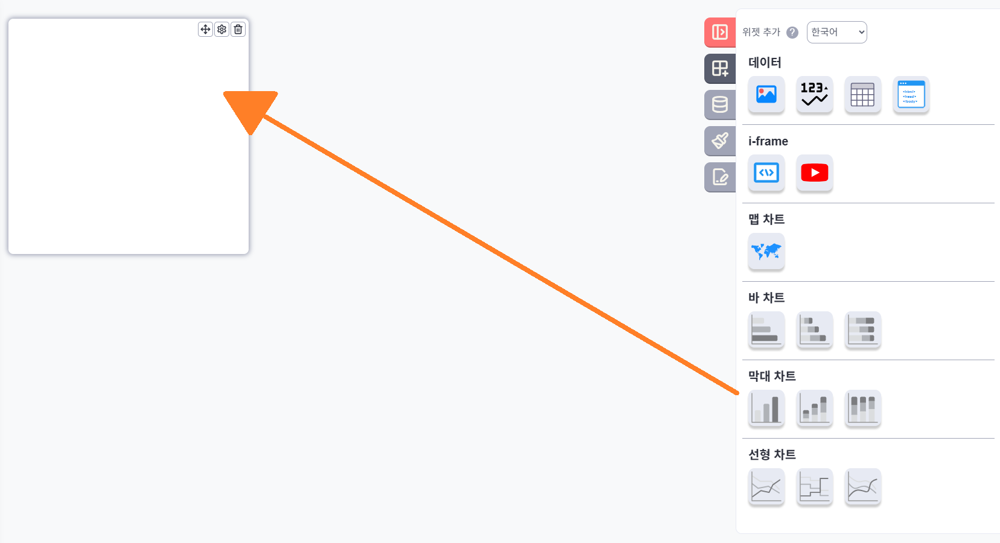
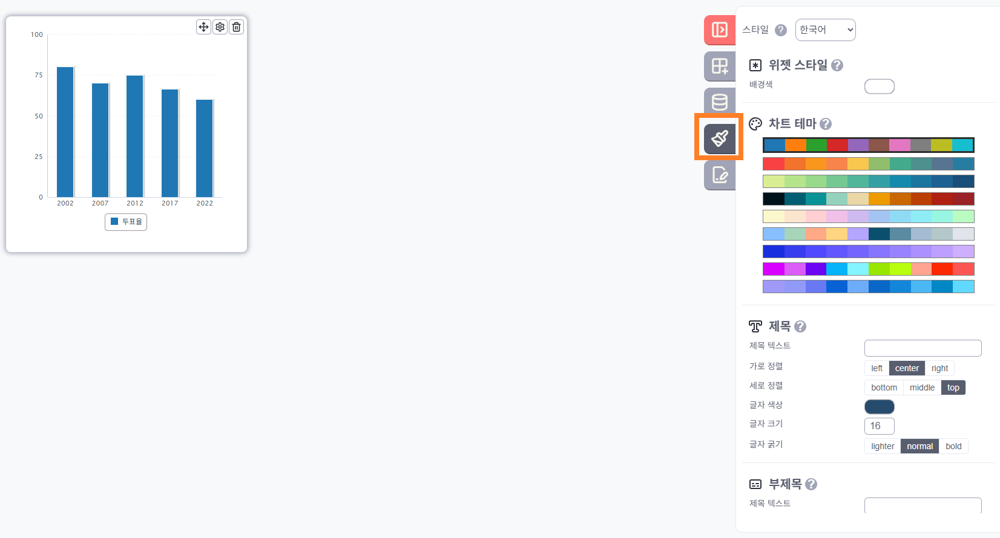
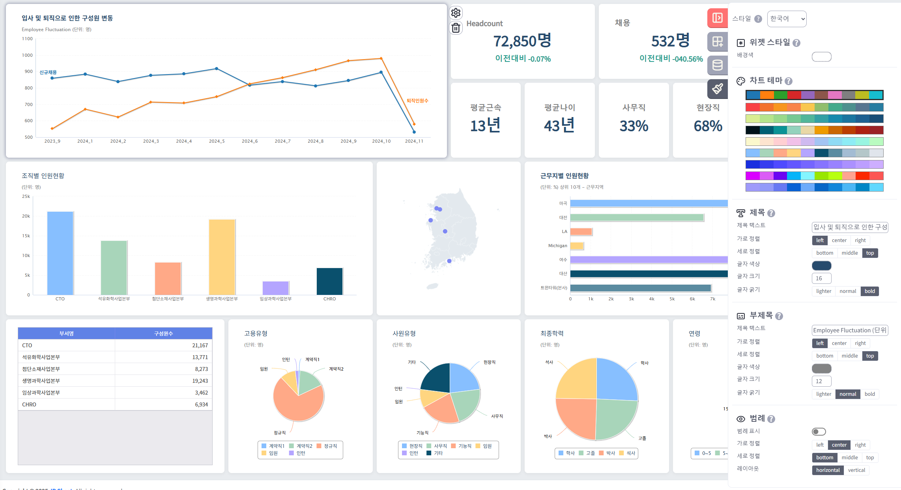

# 제품 개요 및 사용 가이드

---

## 제품 소개

대시보드 위젯 구성 도구는 사용자가 쉽고 직관적으로 데이터 시각화 대시보드를 만들 수 있는 웹 기반 도구입니다. 다양한 위젯을 통해 데이터를 효과적으로 표현하고 분석할 수 있습니다.

## 주요 기능

- 드래그 앤 드롭 방식의 직관적인 인터페이스
- 다양한 데이터 시각화 위젯 제공
- 위젯의 자유로운 배치 및 크기 조정
- 위젯별 상세 설정 기능
- 데이터 바인드 기능 (json 데이터셋 연결)
- 설정된 내용에 대한 load 및 save 기능
- 향후 지속적인 위젯 추가 예정

## 기본 사용법

### 최초 설정

1. 대시보드 core js 파일과 관련 위젯 컴포넌트 js 파일, 그리고 css 파일을 include 합니다.

```html
<link
  rel="stylesheet"
  type="text/css"
  href="./js/ibsheet/css/default/main.css"
/>
<link
  rel="stylesheet"
  type="text/css"
  href="./js/ibmap/css/ibmap.css"
/>

<script type="text/javascript" src="./js/ibsheet/ibsheet.js"></script>
<script type="text/javascript" src="./js/ibsheet/locale/ko.js"></script>
<script
  type="text/javascript"
  src="./js/ibchart/highcharts/highcharts.js"
></script>
<script type="text/javascript" src="./js/ibchart/ibchartinfo.js"></script>
<script type="text/javascript" src="./js/ibchart/ibchart.js"></script>
<script type="text/javascript" src="./js/ibmap/ibmap.js"></script>

<script type="text/javascript" src="./js/dashbuilder/dashbuilder.js"></script>
```

2. body테그 안에 dashboard가 위치할 곳에 div 객체를 생성합니다.

```html
<div class="contents">
  <div id="dash1"></div>
</div>
```

3. body.onload 이벤트에서 dashboard를 초기화 합니다.

```js
const OPT = {
  options: {
    level: 0,
    children: [],
  },
  dataSets: [
    {
      id: "data1", //테이블 id
      name: "국가 / 도시별 강수량(2024)", //테이블 명
      keyMap: {
        country: { Header: "국가", Type: "Text" },
        region: { Header: "도시", Type: "Text" },
        jan: { Header: "1월", Type: "Number" },
        feb: { Header: "2월", Type: "Number" },
        mar: { Header: "3월", Type: "Number" },
        apr: { Header: "4월", Type: "Number" },
        //  ...  테이블 컬럼 정보 ..
      },
      data: [
        // ... 테이블 데이터 ...
      ],
    },
    {
      id: "data2",
      name: "기업별매출현황(2024)", // 테이블 명
      keyMap: {
        sCorp: { Header: "기업명", Type: "Text" },
        sPerson: { Header: "직원수", Type: "Int" },
        sPreYear: { Header: "전년도매출", Type: "Number" },
        sYear: { Header: "올해매출", Type: "Number" },
        //  ...  테이블 컬럼 정보 ..
      },
      data: [
        // ... 테이블 데이터 ...
      ],
    },
    // ... 테이블 데이터 ...
  ],
};
DashBuilder.create(document.getElementById("dash1"), OPT);
```

### 초기 화면

처음 접속하면 빈 화면이 표시되며, 우측 상단에 톱니바퀴 아이콘만 표시됩니다.


### 위젯 추가하기

1. 화면 우측 상단의 톱니바퀴 아이콘을 클릭합니다.
2. 우측에서 서랍 형태의 메뉴가 열립니다.
3. 서랍에는 추가 가능한 위젯 목록이 표시됩니다.


### 사용 가능한 위젯 종류

현재 다음과 같은 위젯을 제공하고 있으며, 향후 지속적으로 확장될 예정입니다:

- **그리드**: 표 형태로 데이터 표시
- **차트**: 다양한 그래프로 데이터 시각화
- **KPI**: 핵심 성과 지표 표시
- **이미지**: 이미지 표시
- **맵**: 지도 기반 데이터 시각화

### 위젯 배치 및 크기 조정

- 위젯을 선택하면 대시보드 영역에 기본 크기로 표시됩니다.
- 마우스로 위젯을 드래그하여 원하는 위치로 이동할 수 있습니다.
- 위젯의 모서리나 가장자리를 드래그하여 크기를 자유롭게 조정할 수 있습니다.
- 대시보드는 안보이는 가로 12개의 칸으로 이루어져 위치 조정 및 크기 조정시 틀에 맞춰집니다.
- 대시보드는 브라우저 크기 조정시 화면 크기에 맞게 늘어나거나 줄어듭니다.



### 위젯 설정하기

1. 위젯에 마우스를 올리면 오른쪽에 톱니바퀴 버튼과 X 버튼이 표시됩니다.
2. 이 아이콘을 클릭하면 우측에 해당 위젯에 대한 설정 서랍이 열립니다.
3. 서랍에서 위젯의 다양한 속성을 설정할 수 있습니다.
4. X버튼을 통해 위젯을 제거할 수 있습니다.


[위젯 데이터 설정]


[위젯 디자인 설정]


(위젯의 종류에 따라 우측 설정의 내용도 변경됩니다.)

## 위젯별 설정 옵션

각 위젯 유형에 따라 다양한 설정이 가능합니다:

### 그리드 위젯 설정

- 데이터 소스 선택
- 표시할 열 선택
- 정렬 방식
- 컬럼 너비 조정 여부 설정

### 차트 위젯 설정

- 차트 유형 (선, 막대, 파이 등)
- 데이터 소스 및 필드 매핑
- 색상 테마
- 타이틀 설정
- 범례 위치 및 표시 여부
- 축 레이블 설정

### KPI 위젯 설정

- 지표 데이터 소스
- 비교 기준 설정
- 색상 및 아이콘
- 포맷 설정

### 이미지 위젯 설정

- 이미지 업로드 또는 URL 설정
- 크기 조정 방식
- 대체 텍스트

### 맵 위젯 설정

- 지도 유형
- 데이터 소스
- 위치 데이터 필드 매핑
- 색상 및 크기 매핑

## 실제 구현 화면 예시


[대시보드 구성]



[위젯 설정 서랍]

## 데이터 load 및 save 기능

- 미리 설정된 대시보드의 내용을 로드 할 수 있습니다. (데이터 구조는 json 형식)
- 관리자가 수정한 위젯의 위치 및 내용은 함수를 통해 추출되어 저장할 수 있습니다.

## 향후 계획

- 현재 제공되는 위젯 외에도 다양한 유형의 위젯을 지속적으로 추가할 예정입니다. (더 많은 차트 유형, 비디오, iframe 등)
- 사용자 피드백을 반영하여 기능을 개선하고 확장해 나갈 계획입니다.
