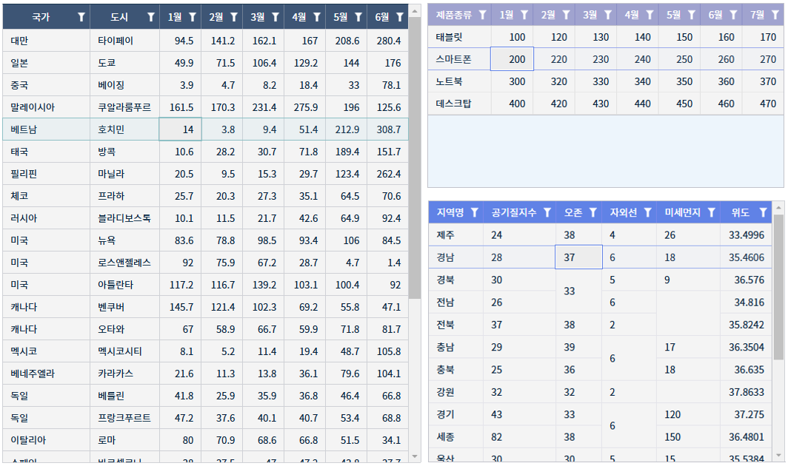
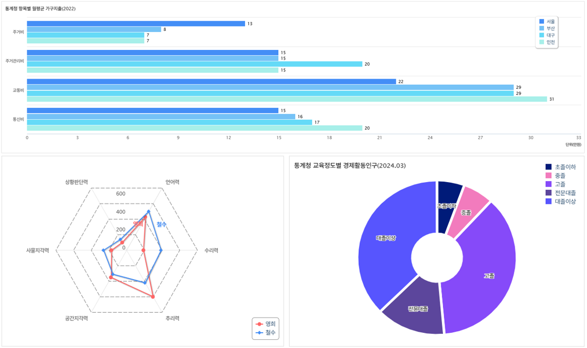
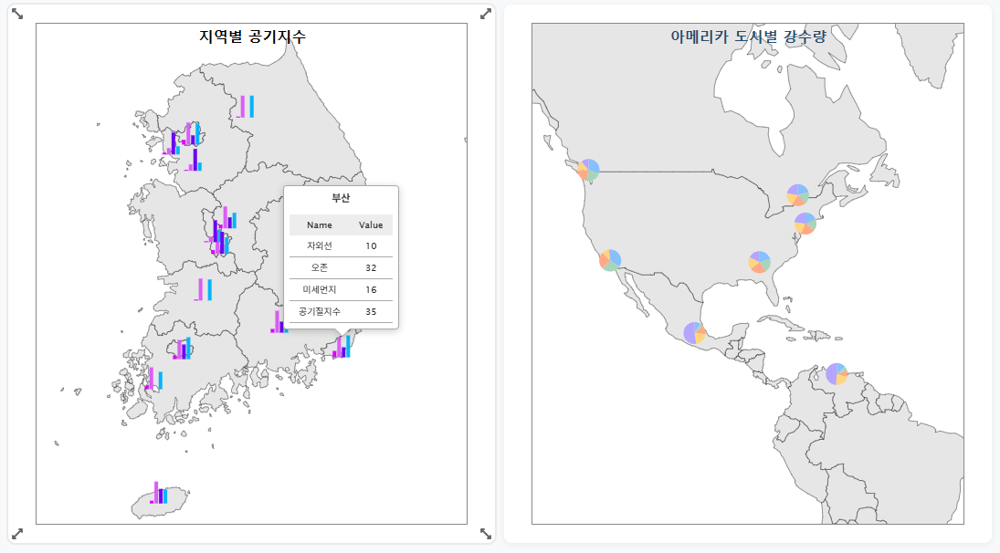
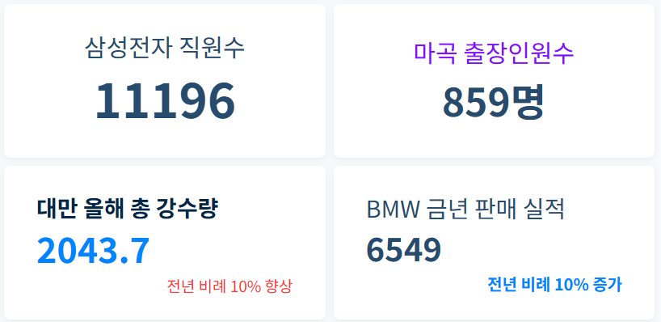
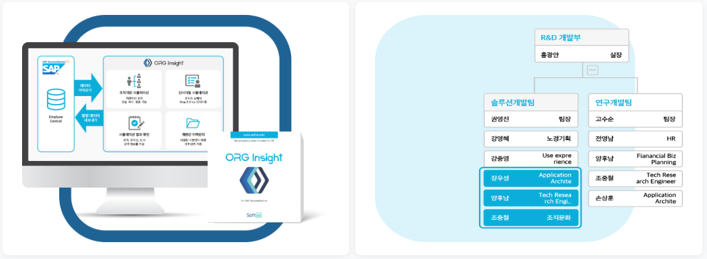

## 위젯 목록

현재 DashBuilder에서 제공하는 widget들은 크게 5개로 분류됩니다.
| 위젯 종류 | 설명 |
| :--: | -- |
| 시트 | IBSheet를 사용한 위젯 |
| 차트 | IBChart를 사용한 위젯 |
| 맵 | IBMap를 사용한 위젯 |
| KPI | 데이터 지수를 나타내는 위젯 |
| 이미지 | 이미지 위젯 |

### 시트

### 차트

### 맵

### KPI

### 이미지

