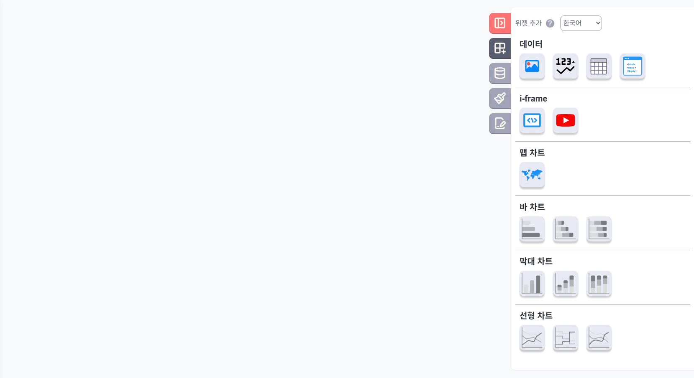
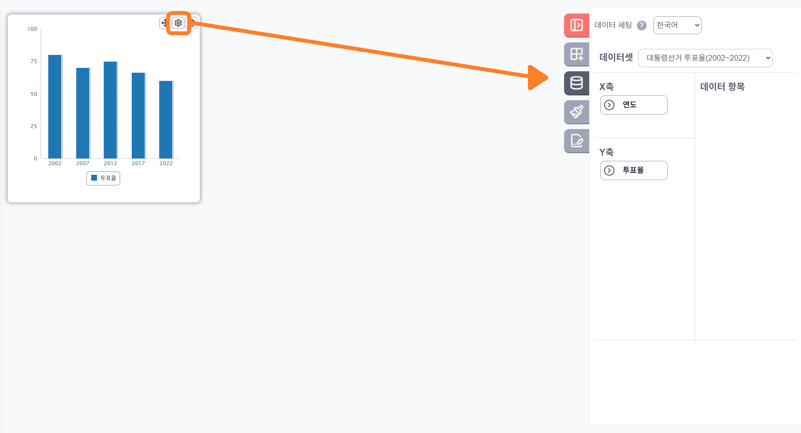

## 위젯 추가하기

1. 화면 우측 상단의 톱니바퀴 아이콘을 클릭합니다.
2. 우측에서 서랍 형태의 메뉴가 열립니다.
3. 서랍에는 추가 가능한 위젯 목록이 표시됩니다.

## 위젯 배치 및 크기 조정

- 위젯을 선택하면 대시보드 영역에 기본 크기로 표시됩니다.
- 마우스로 위젯을 드래그하여 원하는 위치로 이동할 수 있습니다.
- 위젯의 모서리나 가장자리를 드래그하여 크기를 자유롭게 조정할 수 있습니다.
- 대시보드는 안보이는 가로 12개의 칸으로 이루어져 위치 조정 및 크기 조정시 틀에 맞춰집니다.
- 대시보드는 브라우저 크기 조정시 화면 크기에 맞게 늘어나거나 줄어듭니다.

## 위젯 설정하기

1. 위젯에 마우스를 올리면 오른쪽에 톱니바퀴 버튼과 X 버튼이 표시됩니다.
2. 이 아이콘을 클릭하면 우측에 해당 위젯에 대한 설정 서랍이 열립니다.
3. 서랍에서 위젯의 다양한 속성을 설정할 수 있습니다.
4. X버튼을 통해 위젯을 제거할 수 있습니다.

