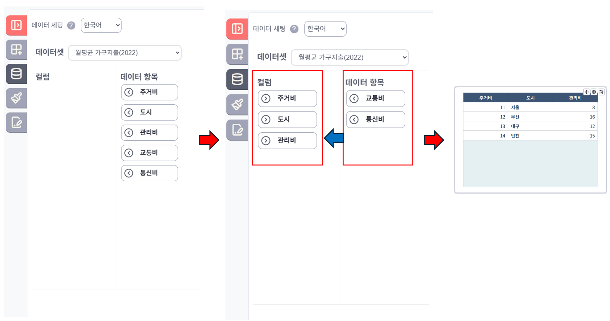

## 시트의 데이터셋 구조
시트의 데이터셋 구조는 Columns과 Data Items로 구성되어 있습니다.

Data Item 목록에서 시트에 표현하고자 하는 항목들을 Columns에 추가하여 시트에 보여지는 데이터들을 선택할 수 있습니다.

## 구성 요소

### Columns
- 시트에 실제로 표시될 데이터 열을 정의합니다.
- Data Items에서 항목을 드래그하여 Columns에 추가할 수 있습니다.
- 추가된 항목은 시트에 열로 표시됩니다.

### Data Items
- 시트에 표시할 수 있는 모든 데이터 항목의 목록입니다.
- 사용자가 원하는 항목을 선택하여 Columns에 추가할 수 있습니다.

## 사용 방법
1. Data Items 목록에서 시트에 표시하고자 하는 항목을 선택합니다.
2. 선택한 항목을 Columns 영역으로 드래그하여 추가합니다.
3. 추가된 항목에 따라 시트의 열 구성이 자동으로 업데이트됩니다.
4. 필요한 경우 Columns 내에서 항목의 순서를 변경하여 시트 열의 순서를 조정할 수 있습니다.

## 참고 사항
- Columns에 추가된 항목만 시트에 표시됩니다.
- 컬럼의 순서는 데이터 표시 순서에 영향을 줍니다.
- 시트 위젯의 크기에 따라 모든 컬럼이 한 화면에 표시되지 않을 수 있으며, 이 경우 가로 스크롤이 생성됩니다.