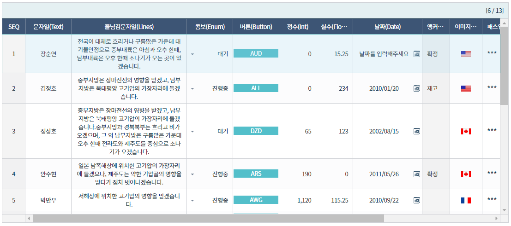
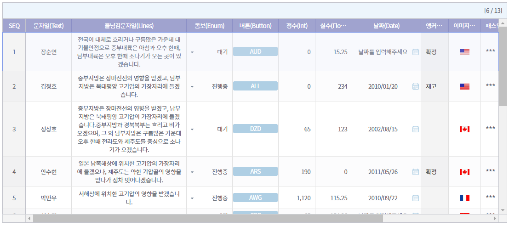
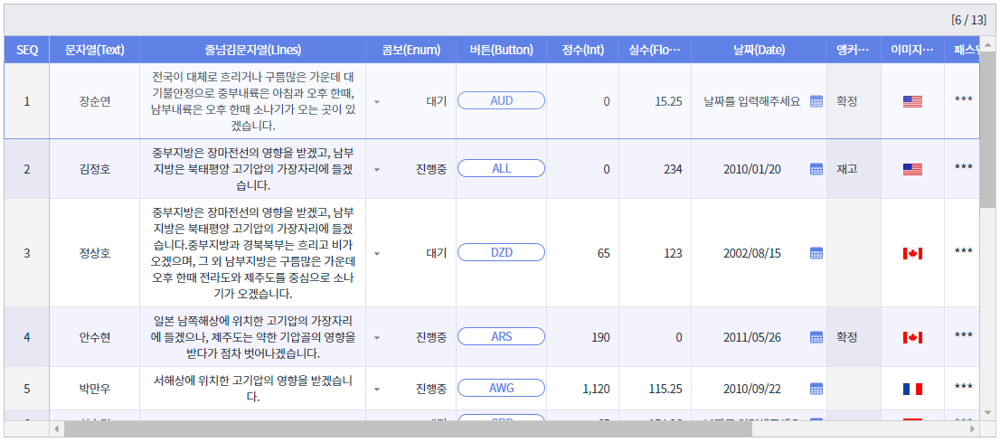
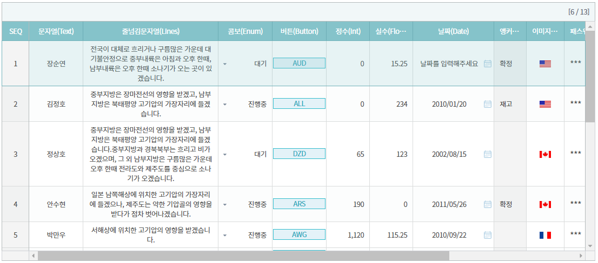
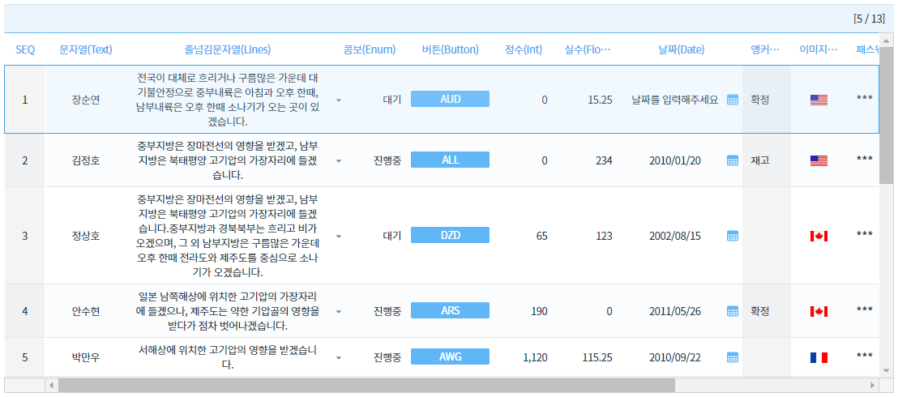

# Theme

## 타입

`String`

## 값
- default : "기본"
- 기본 || Grace || Material || Mint || Simple

## [설명](https://docs.ibsheet.com/ibsheet/v8/manual/#docs/appx/design)

- 기본 테마(/css/default/main.css)외에 다른 테마를 적용하고자 할때, 사용할 테마를 설정합니다.
- ibsheet는 5가지 테마를 제공하고 있습니다.

:::warning
해당 기능을 사용하기 위해서는 사용하고자 하는 css 파일이 화면에 include 되어 있어야 합니다.
:::

## 테마
### 기본 테마 
`기본테마<IB>` (/css/default/main.css)

### Grace 테마 
`기본테마<IBGR>` (/css/grace/main.css)

### Material 테마 
`Material 테마<IBMR>`  (/css/material/main.css)

### Mint 테마
`Mint 테마<IBMT>` (/css/mint/main.css)

### Simple 테마 
`Simple 테마<IBSP>` (/css/simple/main.css)

