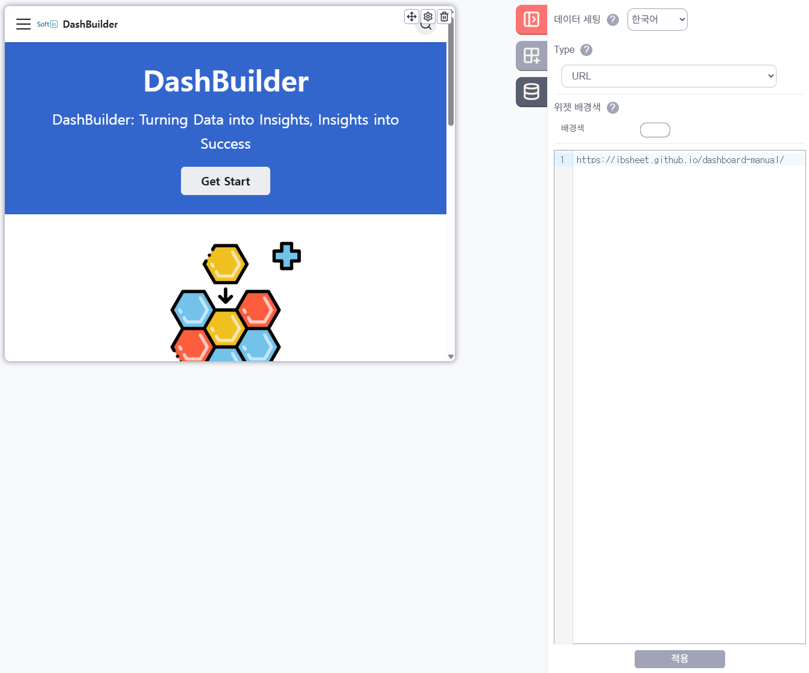

## iframe 위젯 타입 설정
`Type` 필드에서 `URL`, `HTML` 두가지 중 한가지를 선택 합니다.

`URL`의 경우 아래의 Editor 창에 URL 을 입력하고 적용을 누르게 되면 iframe 위젯에 해당 URL 의 화면이 보여집니다.

`HTML`의 경우 아래의 Editor 창에 HTML 코드를 입력하고 적용을 누르게 되면 iframe 위젯에 해당 HTML 코드의 화면이 보여집니다.

