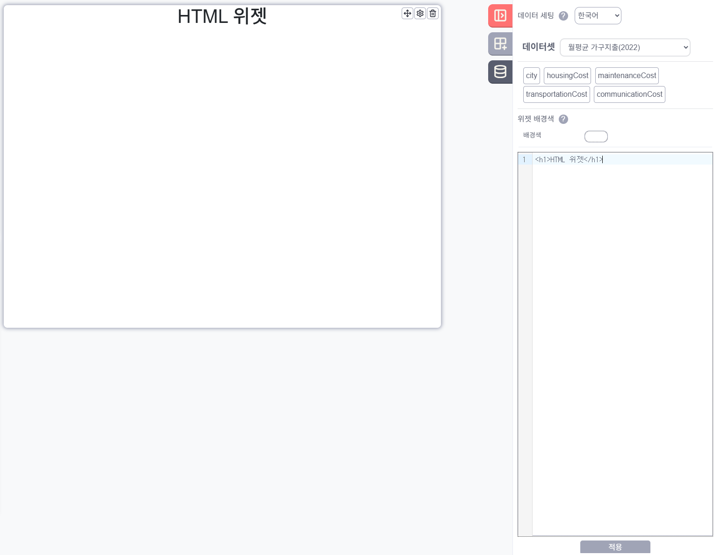
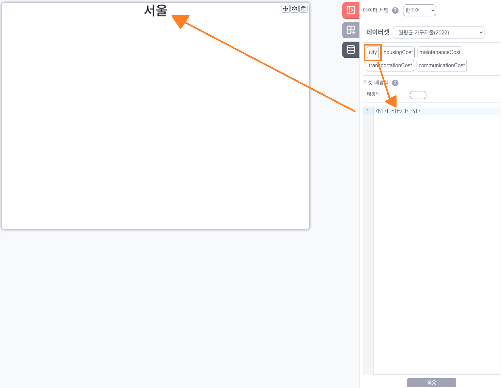

## HTML 위젯 설정 가이드
Data Set 을 HTML 위젯과 연결하게 되면 Data Set 의 Data Item 을 표시합니다.

Editor 창에 HTML 코드를 입력하고 적용을 누르게 되면 HTML 위젯에 해당 HTML 코드의 화면이 표시됩니다.

 Data Set 의 Data Item 을 클릭하게 되면 Editor 창에 Data Item 의 데이터를 참조할 수 있는 코드가 입력됩니다. 
 
 적용을 누르게 되면 HTML 위젯에 해당 HTML 코드의 화면이 표시됩니다.

:::warning
Data Set 의 Data Item 은 첫번째 데이터에 대해서만 참조합니다.
:::